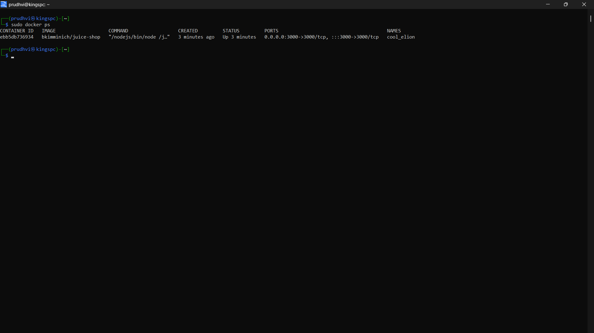
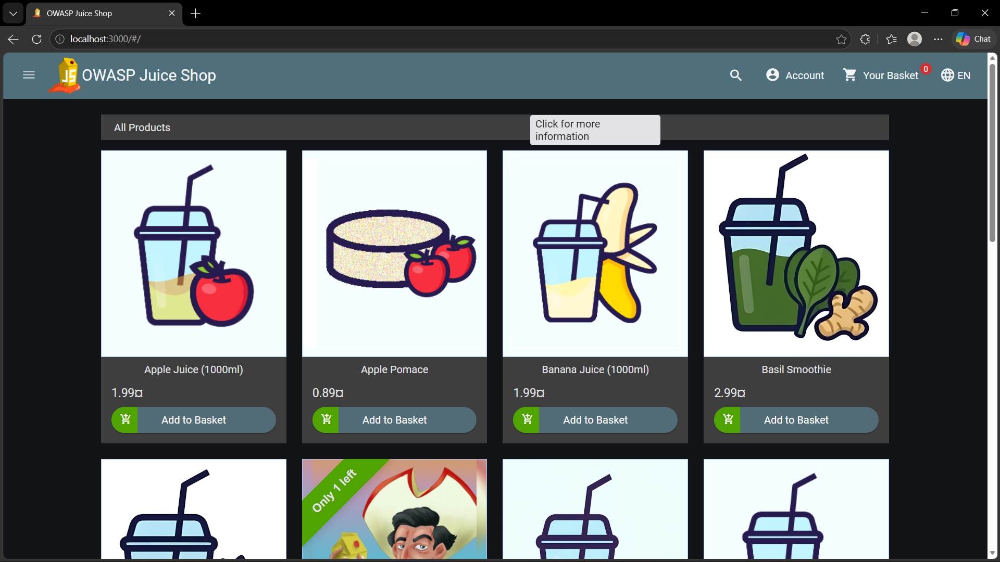
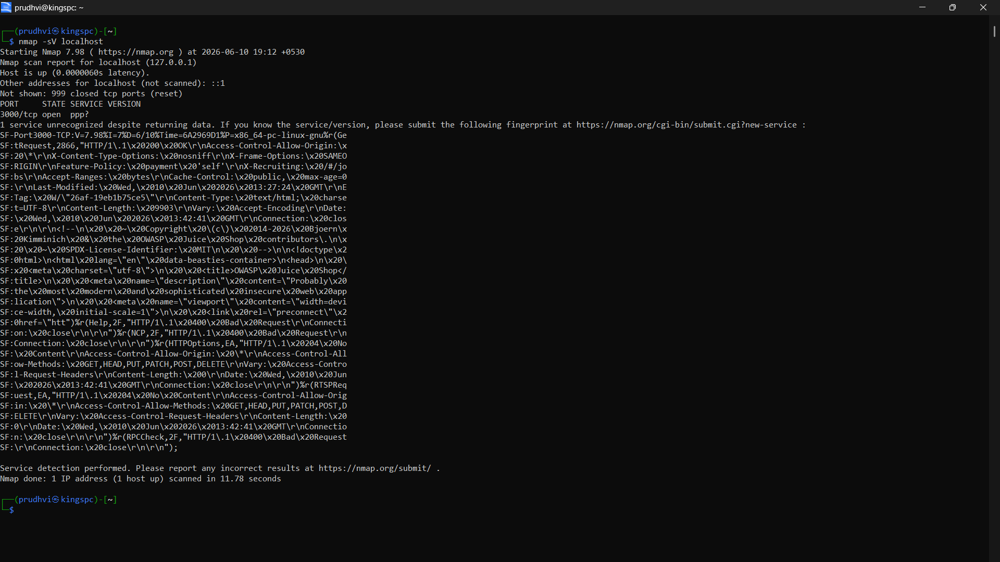
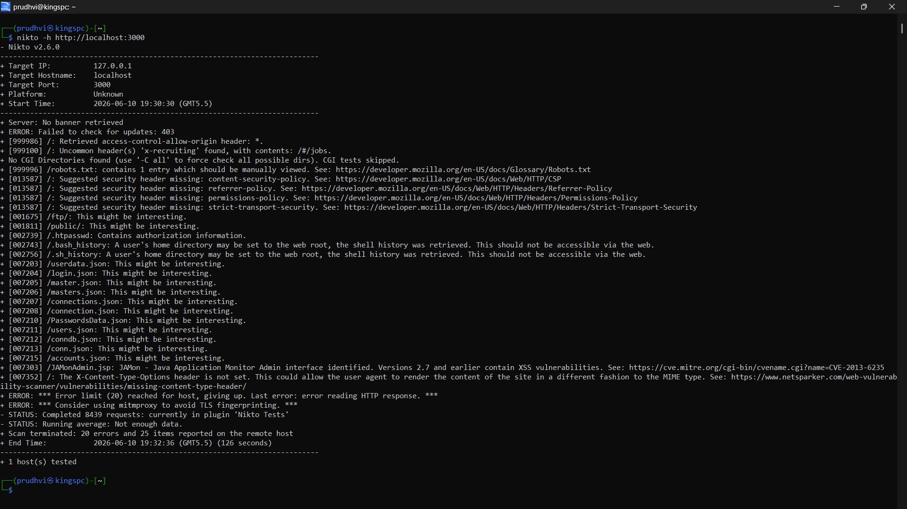
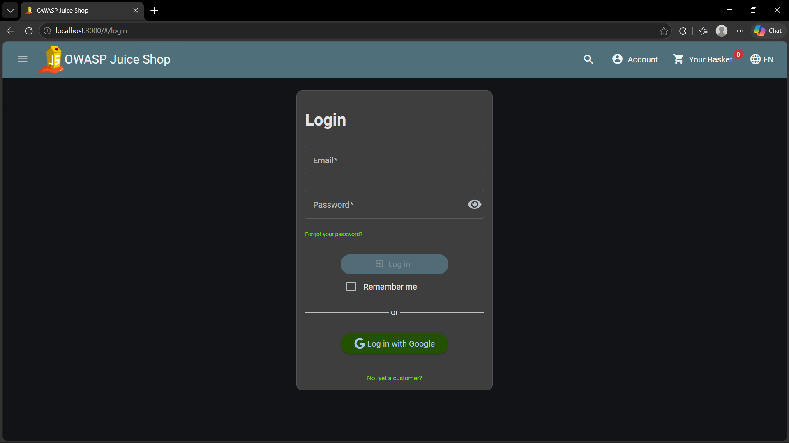

# 🛡️ Vulnerability Assessment and Penetration Testing (VAPT)

## 📌 Project Overview
This project performs Vulnerability Assessment and Penetration Testing (VAPT) on the OWASP Juice Shop web application. The goal is to identify security weaknesses using industry-standard tools and document findings with proper risk analysis.

---

## 🎯 Objective
To analyze a vulnerable web application and identify security misconfigurations, open services, and missing security headers using penetration testing tools.

---

## 🧰 Tools Used
- Kali Linux
- Docker
- OWASP Juice Shop
- Nmap
- Nikto

---

## ⚙️ Methodology

1. Environment Setup  
   OWASP Juice Shop was deployed using Docker.

2. Reconnaissance  
   Nmap was used to identify open ports and services.

3. Vulnerability Scanning  
   Nikto was used to detect missing security headers and misconfigurations.

4. Verification  
   Results were manually verified using browser access.

5. Documentation  
   All findings were recorded with recommendations.

---

## 📸 Screenshots

### 🔹 Docker Setup Running

---

### 🔹 OWASP Juice Shop Home Page

---

### 🔹 Nmap Service Scan

---

### 🔹 Nikto Vulnerability Scan

---

### 🔹 Login Page

---

## 📊 Key Findings
- Missing Content Security Policy (CSP)
- Missing HSTS Header
- Missing Referrer Policy
- Open web service on port 3000

---

## 🔐 Security Recommendations
- Implement Content Security Policy (CSP)
- Enable HTTPS with HSTS
- Configure security headers properly
- Regular vulnerability scanning

---

## 🚀 Learning Outcomes
- Web application security testing
- Network scanning using Nmap
- Web vulnerability scanning using Nikto
- Security misconfiguration analysis

---

## 👨‍💻 Author
Prudhvisairaju Poranki
